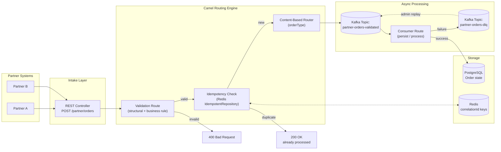
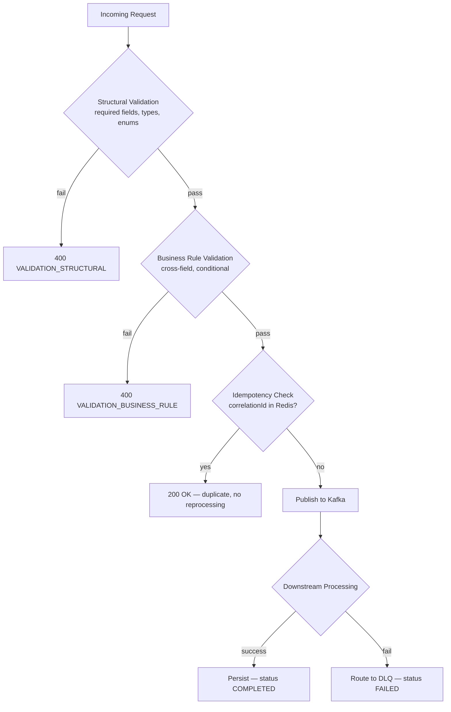
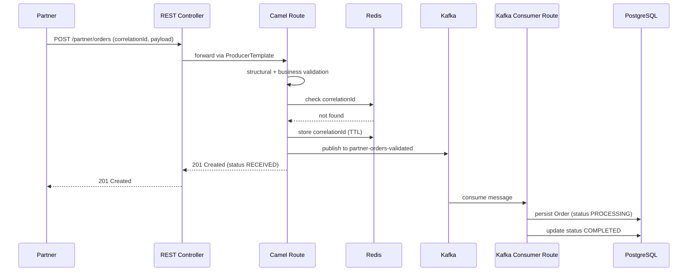
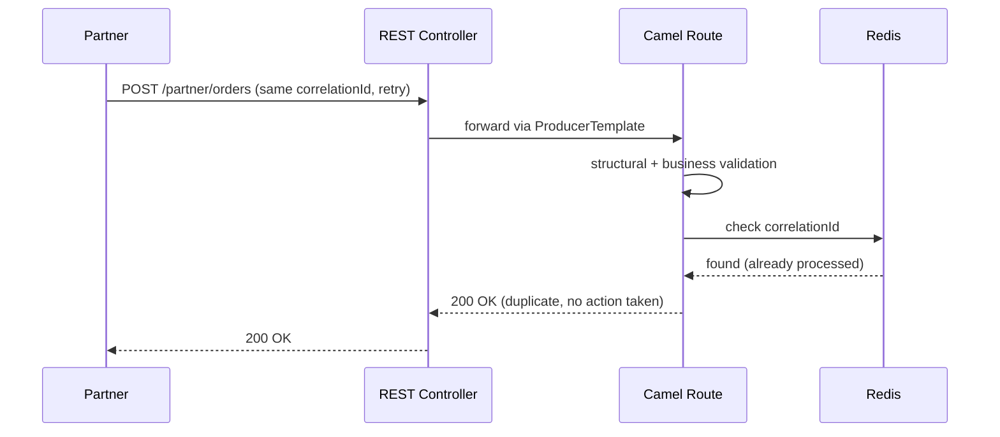
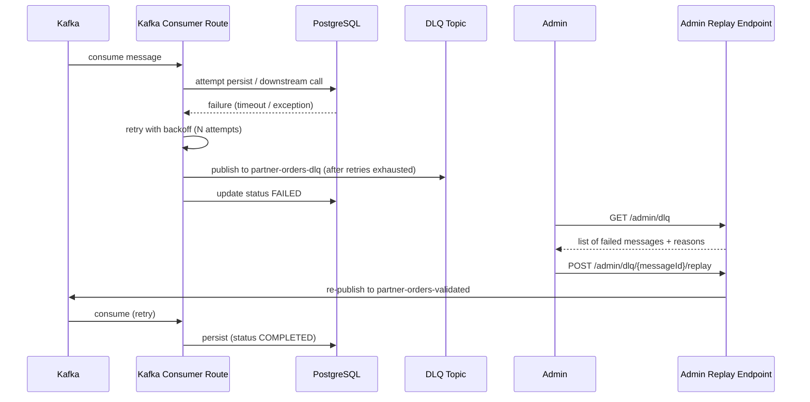
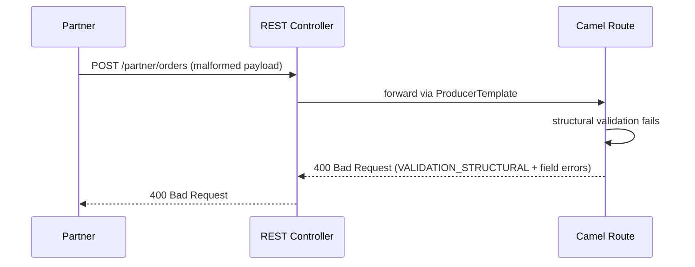
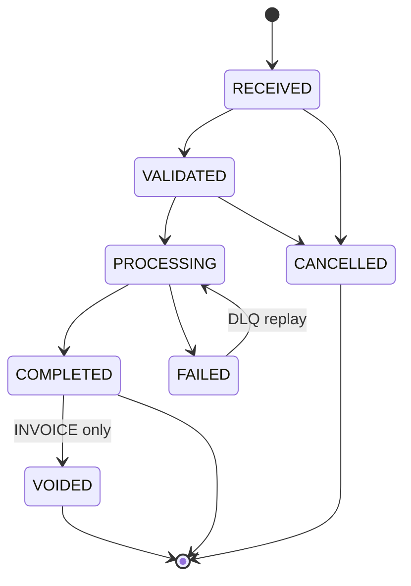

# B2B Integration Engine

A Spring Boot + Apache Camel framework that ingests, validates, deduplicates, routes, and asynchronously processes high-volume B2B partner transactions (orders, invoices, shipment notices), with idempotency, retry, and dead-letter handling for fault tolerance.

---

## Table of Contents

1. [Overview](#overview)
2. [Tech Stack](#tech-stack)
3. [High-Level Architecture](#high-level-architecture)
4. [Data Model](#data-model)
5. [API Endpoints](#api-endpoints)
6. [Order Types](#order-types)
7. [Validation Layers](#validation-layers)
8. [Idempotency Design](#idempotency-design)
9. [Sequence Diagrams](#sequence-diagrams)
10. [State Machine](#state-machine)
11. [Error Handling & DLQ](#error-handling--dlq)
12. [Folder Structure](#folder-structure)
13. [Setup & Running Locally](#setup--running-locally)
14. [Testing Strategy](#testing-strategy)
15. [Design Decisions](#design-decisions)
16. [Known Limitations](#known-limitations)

---

## Overview

Partners (external systems) submit B2B documents — orders, invoices, or shipment notices — over HTTP. The engine validates the payload, deduplicates it using a partner-supplied correlation ID, publishes it to a Kafka topic for asynchronous processing, and persists the result. Failed messages are routed to a dead-letter queue (DLQ) for inspection and replay rather than being lost.

This project demonstrates: Apache Camel routing/transformation, Spring Boot service design, Redis-backed idempotency, Kafka-based async decoupling with DLQ, and a documented order-lifecycle state machine.

---

## Tech Stack

| Layer | Technology |
|---|---|
| Language / Runtime | Java 17, Spring Boot 3.x |
| Integration / Routing | Apache Camel (camel-spring-boot-starter) |
| Messaging | Apache Kafka |
| Idempotency Store | Redis |
| Persistence | PostgreSQL (Oracle-compatible SQL; demoed on Postgres for local dev) |
| Serialization | Jackson (JSON), JAXB (XML) |
| Testing | JUnit 5, CamelTestSupport, Testcontainers |
| Local Infra | Docker Compose |

---

## High-Level Architecture



---

## Data Model

### `Order` (relational entity)

| Field | Type | Notes |
|---|---|---|
| `id` | UUID (PK) | Internally generated, distinct from `correlationId` |
| `correlationId` | String | Partner-supplied, unique, indexed — idempotency key |
| `orderId` | String | Partner's own reference number |
| `partnerId` | String | Indexed — used for routing and query filters |
| `orderType` | Enum | `ORDER`, `INVOICE`, `SHIPMENT_NOTICE` |
| `status` | Enum | `RECEIVED`, `VALIDATED`, `PROCESSING`, `COMPLETED`, `FAILED`, `CANCELLED`, `VOIDED` |
| `totalAmount` | BigDecimal | Nullable — required only for `ORDER`/`INVOICE` |
| `currency` | String | Nullable |
| `relatedOrderId` | String | Nullable — links `INVOICE`/`SHIPMENT_NOTICE` back to originating `ORDER` |
| `shippingAddress` | JSON/embedded | Nullable — required only for `SHIPMENT_NOTICE` |
| `version` | Long | Optimistic locking counter |
| `createdAt` / `updatedAt` | Timestamp | Audit fields |

### `OrderItem` (child entity, `ORDER` only)

| Field | Type | Notes |
|---|---|---|
| `sku` | String | Required |
| `quantity` | Integer | > 0 |
| `unitPrice` | BigDecimal | ≥ 0 |

### `DlqEntry`

| Field | Type | Notes |
|---|---|---|
| `messageId` | String | |
| `originalCorrelationId` | String | |
| `failureReason` | String | |
| `failedAt` | Timestamp | |
| `retryCount` | Integer | |

---

## API Endpoints

| Method | Path | Purpose | Success Code |
|---|---|---|---|
| POST | `/partner/orders` | Create a new order/invoice/shipment notice | `201` (or `200` if duplicate) |
| GET | `/partner/orders/{orderId}` | Get current status | `200` |
| PUT | `/partner/orders/{orderId}` | Update (ORDER: full, SHIPMENT_NOTICE: limited, INVOICE: rejected) | `200` |
| POST | `/partner/orders/{orderId}/cancel` | Cancel / void | `200` |
| GET | `/partner/orders` | List/query with filters + pagination | `200` |
| POST | `/admin/dlq/{messageId}/replay` | Re-publish a failed message | `202` |
| GET | `/admin/dlq` | Inspect DLQ contents | `200` |
| GET | `/actuator/health` | Health check | `200` |

Full request/response JSON examples, field-level validation rules, and per-order-type operation support are covered in the Project Implementation Guide (companion doc).

---

## Order Types

| Type | Represents | Mandatory extra fields |
|---|---|---|
| `ORDER` | Purchase/sales order | `items[]`, `totalAmount`, `currency` |
| `INVOICE` | Payment request for a delivered order | `totalAmount`, `currency`, `relatedOrderId` |
| `SHIPMENT_NOTICE` | Advance shipping notice | `shippingAddress`, `relatedOrderId` |

---

## Validation Layers



---

## Idempotency Design

- `correlationId` is **partner-generated**, sent as `X-Correlation-ID` header (or body field), and must remain identical across retries of the same logical transaction.
- On intake, Camel's `idempotentConsumer` checks a Redis-backed `IdempotentRepository` keyed on `correlationId`.
- If the key exists → short-circuit, return `200 OK` with the original result, no reprocessing.
- If the key doesn't exist → proceed, and write the key to Redis (with TTL, e.g., 24–72h) once accepted.
- The server **never generates** `correlationId` on the partner's behalf — a missing ID is a validation failure (`400`), not an auto-fill.

---

## Sequence Diagrams

### 1. Create Order — Happy Path



### 2. Duplicate Submission (Idempotent Replay)



### 3. Downstream Failure → DLQ → Replay



### 4. Validation Failure (Rejected at Intake)



---

## State Machine



**Notes:**
- `INVOICE` supports `VOIDED` instead of a full update (immutable financial document).
- `SHIPMENT_NOTICE` only permits cancellation while still `RECEIVED`/`VALIDATED` (i.e., before dispatch).
- `ORDER` supports the full transition set including standard `Update`.

---

## Error Handling & DLQ

- **Structural/business validation failures** are rejected synchronously at intake (`400`) — never enter the async pipeline.
- **Transient downstream failures** (e.g., DB timeout) are retried with backoff inside the Camel route (`onException().maximumRedeliveries(3).redeliveryDelay(...)`).
- **Permanent failures** (retries exhausted) are routed to `partner-orders-dlq` via `errorHandler(deadLetterChannel("kafka:partner-orders-dlq"))`, and the order's status is set to `FAILED`.
- **Replay** re-publishes a DLQ message back onto the main topic after the underlying issue is resolved (e.g., downstream service back online), without requiring the partner to resubmit.
- Every log line and DLQ entry carries `correlationId` in the MDC for end-to-end traceability.

---

## Folder Structure

```
b2b-integration-engine/
├── docker-compose.yml
├── README.md
├── src/main/java/com/example/integration/
│   ├── controller/
│   │   ├── OrderController.java
│   │   └── DlqAdminController.java
│   ├── routes/
│   │   ├── IntakeRoute.java
│   │   ├── ValidationRoute.java
│   │   ├── ProcessingRoute.java
│   │   └── DlqRoute.java
│   ├── idempotency/
│   │   └── RedisIdempotentRepository.java
│   ├── model/
│   │   ├── PartnerOrder.java
│   │   ├── OrderItem.java
│   │   └── OrderType.java
│   ├── entity/
│   │   ├── Order.java
│   │   └── DlqEntry.java
│   ├── repository/
│   │   ├── OrderRepository.java
│   │   └── DlqEntryRepository.java
│   ├── validation/
│   │   ├── StructuralValidator.java
│   │   └── BusinessRuleValidator.java
│   └── exception/
│       ├── ValidationException.java
│       └── InvalidStateTransitionException.java
└── src/test/java/com/example/integration/
    ├── routes/*.java (CamelTestSupport route tests)
    └── integration/*.java (Testcontainers end-to-end tests)
```

---

## Setup & Running Locally

```bash
# 1. Start dependencies (Kafka, Redis, Postgres)
docker compose up -d

# 2. Run the application
mvn spring-boot:run

# 3. Run tests
mvn test

# 4. Send a sample order
curl -X POST http://localhost:8080/partner/orders \
  -H "Content-Type: application/json" \
  -H "X-Correlation-ID: $(uuidgen)" \
  -d @sample-payloads/order.json
```

---

## Testing Strategy

| Test Type | Tool | Covers |
|---|---|---|
| Route unit tests | CamelTestSupport / AdviceWithRouteBuilder | Individual route logic, mocked endpoints |
| Idempotency test | JUnit + embedded/mocked Redis | Duplicate correlationId is blocked |
| Validation tests | JUnit | Structural + business rule rejection cases |
| Integration tests | Testcontainers (Kafka, Redis, Postgres) | Full end-to-end flow, real infra |
| DLQ tests | CamelTestSupport | Simulated downstream failure routes to DLQ correctly |

---

## Design Decisions

- **Redis for idempotency** over a DB unique constraint: faster lookups, natural TTL-based expiry, avoids adding write contention to the primary transactional store.
- **Kafka over synchronous processing**: decouples intake from processing, absorbs load spikes, and enables replay — a synchronous design couldn't support DLQ replay semantics as cleanly.
- **INVOICE is immutable (voided, not updated)**: mirrors real-world accounting/audit requirements — financial documents shouldn't be silently mutated.
- **SHIPMENT_NOTICE supports only limited updates**: it reports a fact (dispatch), so most fields shouldn't change after creation; only correctable metadata (e.g., tracking number) is editable.
- **Status codes are semantically distinct** (`201` new, `200` idempotent/read, `202` accepted-async, `409` conflict, `400` validation) rather than defaulting to `200` everywhere.

---

## Known Limitations

- No real payment or logistics integration — `INVOICE`/`SHIPMENT_NOTICE` are persisted but not processed against external systems.
- No automatic reconciliation between an `INVOICE`/`SHIPMENT_NOTICE` and its `relatedOrderId` (flagging mismatches) — a reasonable future extension.
- Idempotency relies on the partner sending a stable `correlationId`; no fallback dedup on `partnerId + orderId` is implemented in the base version (noted as a possible enhancement).
- Demoed against PostgreSQL rather than Oracle for local development ease; schema is written to be Oracle-compatible SQL.